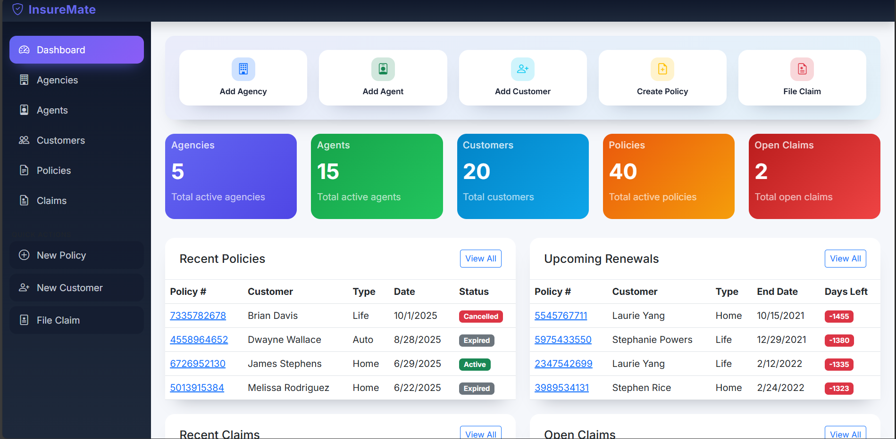
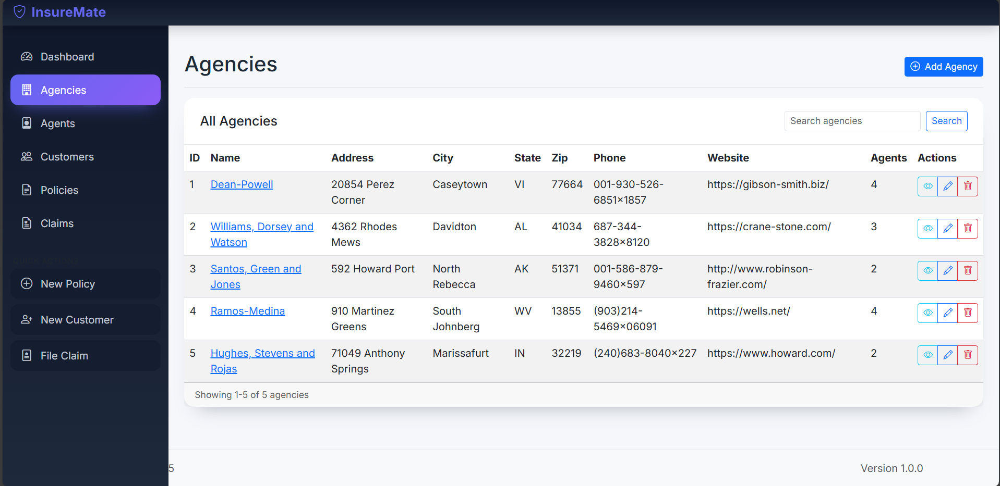

Flask-based web application for managing insurance agencies, agents, customers, policies, and claims.

## Features

- **Agency Management**: Create, view, edit, and delete insurance agencies
- **Agent Management**: Manage insurance agents and their assignments to agencies
- **Customer Management**: Handle customer information and contact details
- **Policy Management**: Create and manage insurance policies with various types and coverage
- **Claims Management**: Track and process insurance claims with status updates
- **Dashboard**: Overview of key metrics and recent activities
- **Search & Filter**: Advanced search and filtering capabilities across all entities
- **Responsive Design**: Modern, mobile-friendly user interface using Bootstrap 5

## Technology Stack

- **Backend**: Python 3.9+, Flask
- **Database**: SQLAlchemy (SQLite by default)
- **Frontend**: HTML5, Bootstrap 5, JavaScript
- **Icons**: Bootstrap Icons
- **Migration**: Flask-Migrate

## Installation

1. **Clone the repository**
   ```bash
   git clone <repository-url>
   cd insurance-management-system
   ```

2. **Create a virtual environment**
   ```bash
   python -m venv venv
   source venv/bin/activate  # On Windows: venv\Scripts\activate
   ```

3. **Install dependencies**
   ```bash
   pip install -r requirements.txt
   ```

4. **Set up the database**
   ```bash
   # If migrations folder doesn't exist, initialize it first
   # flask db init
   
   # Create migration for database schema
   flask db migrate -m "Initial migration"
   
   # Apply migrations to database
   flask db upgrade
   
   # Or use the CLI command to create tables directly
   flask create-db
   ```

5. **Run the application**
   ```bash
   python app.py
   ```

The application will be available at `http://localhost:5000`

## Run with Docker (Recommended for Containers)

To run InsureMate inside a container without manually installing Python or dependencies, use the provided Docker setup.

1. **Build and start the stack**
   ```bash
   docker compose up --build
   ```

   This command builds the image, runs database migrations automatically, and starts the Flask development server on port `5000`.

2. **Access the application**
   Visit [http://localhost:5000](http://localhost:5000) in your browser.

3. **Stop the stack**
   Press `Ctrl+C` in the terminal, then run:
   ```bash
   docker compose down
   ```

### Docker configuration

- The local project folder is mounted into the container, so code changes are reflected immediately without rebuilding.
- SQLite data is stored in a named Docker volume (`insuremate-db`) to persist between runs.
- Environment variables such as `DATABASE_URL`, `FLASK_ENV`, and `SECRET_KEY` can be customised in `docker-compose.yml` as needed.

## Testing

This project includes a comprehensive test suite with unit tests for models and integration tests for routes.

### Running Tests

1. **Run all tests**
   ```bash
   pytest
   ```

2. **Run tests with coverage report**
   ```bash
   pytest --cov=models --cov=routes --cov=app --cov-report=term-missing
   ```

3. **Run specific test file**
   ```bash
   pytest tests/test_agency_model.py
   ```

4. **Run tests with verbose output**
   ```bash
   pytest -v
   ```

## Database Schema

The application uses the following main entities:

- **Agency**: Insurance agencies with contact information
- **Agent**: Insurance agents linked to agencies
- **Customer**: Policy holders with personal information
- **Policy**: Insurance policies with coverage details
- **Claim**: Claims filed against policies

## API Endpoints

The application provides RESTful API endpoints for each entity:

- `/agencies/api/agencies` - Get all agencies
- `/agents/api/agents` - Get all agents
- `/agents/api/by-agency/<agency_id>` - Get agents by agency
- `/customers/api/customers` - Get all customers
- `/policies/api/policies` - Get all policies
- `/policies/api/by-customer/<customer_id>` - Get policies by customer
- `/policies/api/by-agent/<agent_id>` - Get policies by agent
- `/claims/api/claims` - Get all claims
- `/claims/api/policy/<policy_id>/claims` - Get claims by policy

## Configuration

The application can be configured by modifying `config.py`:

- Database URL
- Secret key for sessions
- Debug mode settings

## Contributing

1. Fork the repository
2. Create a feature branch
3. Make your changes
4. Add tests if applicable
5. Submit a pull request

## License

This project is licensed under the MIT License - see the LICENSE file for details.

## Support

For support or questions, please create an issue in the repository.

### Previews


